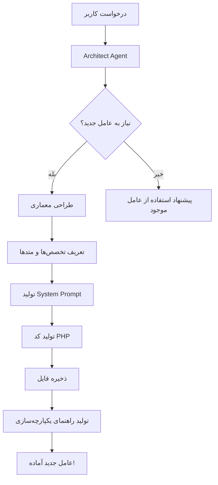

# قابلیت خودتوسعه‌دهندگی نجم‌هدا

## نسخه 1.1.0 - عامل معمار 🏗️

نجم‌هدا حالا می‌تواند **خودش را توسعه دهد**!

---

## 🆕 عامل جدید: Architect (معمار)

معمار نجم‌هدا می‌تواند:

1. ✅ نیاز به عامل جدید را تشخیص دهد
2. ✅ معماری عامل جدید را طراحی کند
3. ✅ کد عامل را تولید کند
4. ✅ فایل PHP را ذخیره کند
5. ✅ راهنمای یکپارچه‌سازی ایجاد کند

---

## 🎯 مثال‌های کاربردی

### مثال 1: ساخت عامل تولید محتوا

```bash
php artisan najm-hoda:create-agent "نیاز به عاملی دارم که محتوا و تبلیغات برای شبکه‌های اجتماعی تولید کنه"
```

**خروجی:**
```
🏗️ معمار نجم‌هدا در حال تحلیل درخواست شما...

📋 مرحله 1: تشخیص نیاز به عامل جدید

┌─────────────────────┬──────────────────────────────┐
│ کلید                │ مقدار                        │
├─────────────────────┼──────────────────────────────┤
│ نیاز به عامل جدید  │ true                         │
│ دلیل                │ هیچ عامل فعلی متخصص تولید... │
│ عامل پیشنهادی       │ ContentAgent                 │
└─────────────────────┴──────────────────────────────┘

🎨 مرحله 2: طراحی معماری عامل جدید

✅ طراحی کامل شد:
📦 نام کلاس: ContentAgent
🎭 نقش: content_creator
🇮🇷 نام فارسی: تولیدکننده محتوا

💼 تخصص‌ها:
   - content_writing
   - social_media
   - advertising
   - seo

🛠️ متدهای کلیدی:
   - generateBlogPost: تولید پست وبلاگ
   - createAdvertisement: ساخت تبلیغ
   - optimizeForSEO: بهینه‌سازی SEO
   - createSocialPost: ایجاد پست شبکه اجتماعی

آیا می‌خواهید این عامل را بسازیم؟ (yes/no) [yes]:
> yes

💻 مرحله 3: تولید کد عامل

✅ عامل ContentAgent با موفقیت ساخته شد!

📚 راهنمای یکپارچه‌سازی:
...

🎉 موفقیت! عامل جدید آماده استفاده است.
📁 مسیر فایل: app/Services/NajmHoda/Agents/ContentAgent.php
```

---

### مثال 2: ساخت عامل تحلیل داده

```bash
php artisan najm-hoda:create-agent "عامل تحلیل داده که بتونه گزارش‌های تحلیلی از داده‌های پروژه بده"
```

---

### مثال 3: ساخت عامل مدیریت پایگاه داده

```bash
php artisan najm-hoda:create-agent "عامل مدیریت دیتابیس برای بهینه‌سازی، پشتیبان‌گیری و monitoring"
```

---

## 🔧 استفاده از Architect Agent در کد

```php
use App\Services\NajmHoda\Agents\ArchitectAgent;

$architect = app(ArchitectAgent::class);

// تشخیص نیاز
$need = $architect->detectNeedForNewAgent(
    "نیاز به عاملی برای مدیریت پرداخت‌ها دارم"
);

// طراحی عامل
$design = $architect->designNewAgent(
    "مدیریت پرداخت‌ها و تراکنش‌های مالی"
);

// تولید کد
$code = $architect->generateAgentCode($design);

// ذخیره
$architect->saveNewAgent($code, 'PaymentAgent');

// دریافت راهنما
$guide = $architect->generateIntegrationGuide('PaymentAgent', 'payment');
```

---

## 🔄 فرآیند کامل توسعه عامل جدید



---

## 📝 ساختار عامل تولید شده

```php
<?php

namespace App\Services\NajmHoda\Agents;

use App\Services\NajmHoda\BaseAgent;

/**
 * [نام فارسی] نجم‌هدا
 * 
 * این عامل توسط Architect Agent طراحی و ساخته شده است.
 */
class [ClassName] extends BaseAgent
{
    protected string $role = '[role]';
    
    protected array $expertise = [
        'expertise_1',
        'expertise_2',
    ];
    
    public function getSystemPrompt(): string
    {
        return "شما [نام فارسی] نجم‌هدا هستید...";
    }
    
    // متدهای تخصصی
    public function method1() { }
    public function method2() { }
}
```

---

## 🎓 مراحل یکپارچه‌سازی

پس از ساخت عامل، باید این مراحل را انجام دهید:

### 1. ثبت در Orchestrator

`app/Services/NajmHoda/NajmHodaOrchestrator.php`:

```php
use App\Services\NajmHoda\Agents\NewAgent;

class NajmHodaOrchestrator
{
    protected NewAgent $newAgent;
    
    public function __construct()
    {
        // ...
        $this->newAgent = app(NewAgent::class);
    }
    
    protected function getAgent(string $name): ?BaseAgent
    {
        return match($name) {
            // ...
            'new_agent' => $this->newAgent,
            default => null,
        };
    }
}
```

### 2. ثبت در Service Provider

`app/Providers/NajmHodaServiceProvider.php`:

```php
$this->app->singleton(NewAgent::class, function ($app) {
    return new NewAgent();
});
```

### 3. اضافه کردن کلمات کلیدی

در `detectIntent` در Orchestrator:

```php
$newAgentKeywords = ['کلمه1', 'کلمه2', ...];

$scores = [
    // ...
    'new_agent' => $this->calculateKeywordMatch($message, $newAgentKeywords),
];
```

---

## 🚀 قابلیت‌های آتی

در نسخه‌های بعدی:

- [ ] **Auto-Integration**: یکپارچه‌سازی خودکار عامل جدید
- [ ] **Agent Testing**: تست خودکار عامل
- [ ] **Learning**: یادگیری از تعاملات و بهبود خودکار
- [ ] **Multi-Agent Collaboration**: همکاری بین عوامل
- [ ] **Agent Versioning**: مدیریت نسخه‌های عوامل
- [ ] **Agent Marketplace**: بازار عوامل نجم‌هدا

---

## 💡 نکات مهم

1. **احتیاط**: همیشه کد تولید شده را قبل از استفاده بررسی کنید
2. **تست**: عامل جدید را در محیط توسعه تست کنید
3. **مستندسازی**: System Prompt را به دقت تنظیم کنید
4. **بهینه‌سازی**: پس از استفاده، متدها را بهینه کنید

---

## 📞 پشتیبانی

برای کمک در ساخت عوامل جدید:

```bash
php artisan najm-hoda:chat "راهنمای ساخت عامل جدید"
```

یا با عامل مهماندار صحبت کنید:

```bash
php artisan najm-hoda:chat "چطور میتونم عامل جدید بسازم؟" --agent=steward
```

---

**نجم‌هدا - سیستم خودتوسعه‌دهنده** 🌟
