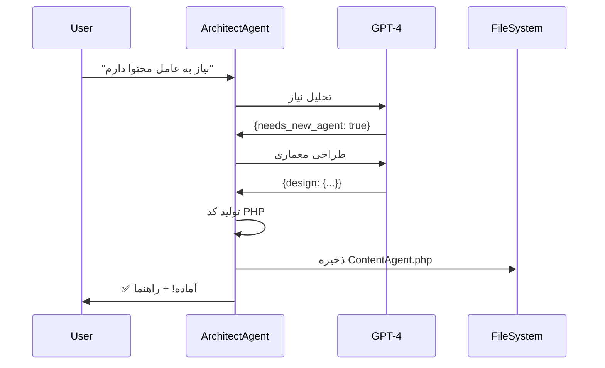

# پاسخ به سوالات نجم‌هدا

## ✅ جواب‌های کامل

---

### سوال 1️⃣: **آیا نجم‌هدا یک ماژول مستقل است؟**

**پاسخ: بله و خیر!** 

نجم‌هدا **نیمه‌مستقل** طراحی شده:

#### ✅ مستقل از نظر:

```
📁 ساختار فایل‌ها:
   app/Services/NajmHoda/          ← کاملاً جدا از بقیه کدها
   ├── BaseAgent.php
   ├── NajmHodaOrchestrator.php
   └── Agents/
       ├── EngineerAgent.php
       ├── PilotAgent.php
       ├── StewardAgent.php
       ├── GuideAgent.php
       └── ArchitectAgent.php       ← جدید! 🆕

📊 دیتابیس:
   - 9 جدول مخصوص خودش
   - مجزا از جداول اصلی پروژه
   - قابل حذف بدون آسیب به سیستم اصلی

⚙️ تنظیمات:
   config/najm-hoda.php             ← فایل کانفیگ جداگانه
   
🔌 API:
   /api/najm-hoda/*                 ← روت‌های مجزا با prefix
   
🎨 UI:
   resources/views/components/      ← ویجت مستقل
       najm-hoda-widget.blade.php
```

#### ⚠️ وابسته به Laravel:

```php
// از امکانات Laravel استفاده می‌کند:
- Service Container (Dependency Injection)
- Eloquent ORM
- Database Migrations
- Blade Templates
- API Routes
- Events & Listeners

// دسترسی به Models اصلی:
- User::count()
- Auction::where('status', 'active')->count()
- Transaction::sum('amount')
```

**نتیجه:** نجم‌هدا یک **ماژول Plug-and-Play** است که می‌تونی:
- ✅ به راحتی نصب/حذف کنی
- ✅ به صورت مستقل توسعه بدی
- ✅ در پروژه‌های دیگر استفاده کنی (با تنظیمات جزئی)

---

### سوال 2️⃣: **آیا نجم‌هدا ماژولار ساخته شده؟**

**پاسخ: بله! کاملاً ماژولار است** 🎯

#### معماری ماژولار فعلی:

```
┌─────────────────────────────────────────┐
│     NajmHodaOrchestrator (هماهنگ‌کننده)    │
│            مسیریابی درخواست‌ها             │
└──────────────┬──────────────────────────┘
               │
       ┌───────┴───────┐
       │               │
   ┌───▼───┐       ┌───▼───┐
   │ Agent │       │ Agent │
   │   1   │  ...  │   N   │
   └───────┘       └───────┘

کل سیستم از 3 لایه تشکیل شده:

1️⃣ BaseAgent (پایه)
   └─ تمام عملیات مشترک

2️⃣ Specialized Agents (عوامل تخصصی)
   ├─ EngineerAgent
   ├─ PilotAgent
   ├─ StewardAgent
   ├─ GuideAgent
   └─ ArchitectAgent 🆕

3️⃣ Orchestrator (هماهنگ‌کننده)
   └─ مسیریابی هوشمند
```

#### مزایای معماری ماژولار:

```php
✅ اضافه کردن عامل جدید بدون تغییر کدهای قبلی
✅ هر عامل مستقل کار می‌کند
✅ تست‌پذیری بالا
✅ نگهداری آسان
✅ توسعه موازی توسط چند نفر
```

#### مثال عملی:

```php
// اضافه کردن عامل جدید:

// 1. فقط کلاس جدید بساز:
class NewAgent extends BaseAgent {
    protected string $role = 'new_role';
    // ...
}

// 2. در Orchestrator ثبت کن:
protected NewAgent $newAgent;

// 3. تمام!
```

**سطح ماژولاریتی: 9/10** 🌟

---

### سوال 3️⃣: **آیا نجم‌هدا می‌تونه عامل جدید بسازه؟**

**پاسخ: بله! از الان می‌تونه!** 🚀

#### عامل جدید: Architect (معمار) 🏗️

**تازه ساختم!** نجم‌هدا حالا می‌تونه خودش رو توسعه بده!

```bash
# مثال کاربردی:
php artisan najm-hoda:create-agent "عاملی برای تولید محتوا و تبلیغات"
```

#### قابلیت‌های Architect Agent:

```
1️⃣ تشخیص نیاز
   └─ تحلیل می‌کنه که آیا واقعاً نیاز به عامل جدید هست

2️⃣ طراحی معماری
   ├─ نام عامل
   ├─ تخصص‌ها
   ├─ متدها
   └─ System Prompt

3️⃣ تولید کد
   └─ کد کامل PHP رو می‌سازه

4️⃣ ذخیره فایل
   └─ فایل .php رو می‌سازه

5️⃣ راهنمای یکپارچه‌سازی
   └─ مراحل ثبت در سیستم رو نشون می‌ده
```

#### مثال‌های واقعی:

##### 1. عامل تولید محتوا:

```bash
php artisan najm-hoda:create-agent "نیاز به عاملی دارم که:
- محتوای جذاب برای وبلاگ بنویسه
- پست اینستاگرام و توییتر بسازه
- تبلیغات گوگل ادز طراحی کنه
- SEO رو بهینه کنه"
```

**نتیجه:**
- 📁 فایل `ContentAgent.php` ساخته می‌شه
- 💼 با 4 متد: `generateBlogPost()`, `createSocialPost()`, `createAdvertisement()`, `optimizeForSEO()`
- 🤖 System Prompt کامل
- 📚 راهنمای استفاده

##### 2. عامل مدیریت پایگاه داده:

```bash
php artisan najm-hoda:create-agent "عامل مدیریت دیتابیس که:
- بهینه‌سازی جداول انجام بده
- پشتیبان‌گیری خودکار
- monitoring و alert
- تحلیل performance"
```

**نتیجه:**
- 📁 `DatabaseAgent.php`
- 💼 متدها: `optimizeTables()`, `backup()`, `monitor()`, `analyzePerformance()`

##### 3. عامل تحلیل داده:

```bash
php artisan najm-hoda:create-agent "تحلیلگر داده برای:
- گزارش‌های تحلیلی
- نمودارها و چارت‌ها
- پیش‌بینی ترند
- KPI Dashboard"
```

**نتیجه:**
- 📁 `AnalyticsAgent.php`
- 💼 متدها: `generateReport()`, `createChart()`, `predictTrend()`, `buildDashboard()`

---

## 🎯 چگونه کار می‌کند؟

### فرآیند کامل:



### کد تولید شده:

```php
<?php

namespace App\Services\NajmHoda\Agents;

use App\Services\NajmHoda\BaseAgent;

/**
 * تولیدکننده محتوا نجم‌هدا
 * 
 * این عامل توسط Architect Agent طراحی و ساخته شده است.
 */
class ContentAgent extends BaseAgent
{
    protected string $role = 'content_creator';
    
    protected array $expertise = [
        'content_writing',
        'social_media',
        'advertising',
        'seo',
    ];
    
    public function getSystemPrompt(): string
    {
        return "شما تولیدکننده محتوای نجم‌هدا هستید.
        
متخصص در:
- نوشتن محتوای جذاب و خلاقانه
- مدیریت شبکه‌های اجتماعی
- طراحی تبلیغات
- بهینه‌سازی SEO

همیشه محتوای باکیفیت، جذاب و مناسب مخاطب تولید کنید.";
    }
    
    /**
     * تولید پست وبلاگ
     */
    public function generateBlogPost(string $topic, array $keywords = []): string
    {
        $prompt = "یک پست وبلاگ کامل بنویس:
        
موضوع: {$topic}
کلمات کلیدی: " . implode(', ', $keywords) . "

پست باید شامل:
- عنوان جذاب
- مقدمه
- محتوای اصلی (حداقل 500 کلمه)
- نتیجه‌گیری
- Call to Action";

        return $this->ask($prompt);
    }
    
    /**
     * ساخت پست شبکه اجتماعی
     */
    public function createSocialPost(string $platform, string $message, array $options = []): string
    {
        $prompt = "یک پست {$platform} بساز:
        
پیام: {$message}

الزامات:
- مناسب {$platform}
- جذاب و engagement‌پذیر
- با هشتگ‌های مناسب
- شامل Call to Action";

        return $this->ask($prompt);
    }
    
    /**
     * طراحی تبلیغ
     */
    public function createAdvertisement(string $product, string $targetAudience): string
    {
        $prompt = "یک تبلیغ طراحی کن:
        
محصول: {$product}
مخاطب: {$targetAudience}

شامل:
- عنوان جذاب
- متن تبلیغ
- Call to Action
- پیشنهادات طراحی گرافیکی";

        return $this->ask($prompt);
    }
    
    /**
     * بهینه‌سازی SEO
     */
    public function optimizeForSEO(string $content, string $targetKeyword): array
    {
        $prompt = "محتوای زیر را برای SEO بهینه کن:

محتوا: {$content}
کلمه کلیدی هدف: {$targetKeyword}

بررسی:
- تراکم کلمه کلیدی
- Meta Description
- Header Tags
- پیشنهادات بهبود";

        $response = $this->ask($prompt);
        
        return [
            'optimized_content' => $response,
            'keyword' => $targetKeyword,
        ];
    }
}
```

---

## 🚀 قابلیت‌های پیشرفته

### 1. تشخیص خودکار نیاز:

```php
// اگر یک درخواست تکرار شه که هیچ عامل فعلی نمی‌تونه جواب بده،
// Architect خودش پیشنهاد می‌ده:

User: "نقشه گوگل مپ بساز"
Architect: "متوجه شدم که ما عامل Maps نداریم. می‌خوای بسازم؟"
```

### 2. یادگیری از تعاملات:

```php
// در آینده می‌تونه از تعاملات یاد بگیره:
- کدوم عامل بیشتر استفاده می‌شه
- چه نوع درخواست‌هایی تکراری هستند
- کدوم قابلیت‌ها کم هستند
```

### 3. توسعه خودکار:

```php
// با اجازه ادمین، می‌تونه خودکار عامل بسازه:

config/najm-hoda.php:
'auto_expansion' => [
    'enabled' => true,              // فعال/غیرفعال
    'require_approval' => true,     // نیاز به تایید
    'max_agents_per_day' => 3,      // محدودیت
]
```

---

## 📊 مقایسه قبل و بعد

### ❌ قبل از Architect Agent:

```
نیاز به عامل جدید → 
  → من باید دستی کد بنویسم
  → چند ساعت زمان
  → احتمال خطا
```

### ✅ بعد از Architect Agent:

```
نیاز به عامل جدید →
  → دستور CLI
  → 2 دقیقه
  → کد آماده + راهنما
```

---

## 🎓 آموزش استفاده

### روش 1: CLI

```bash
php artisan najm-hoda:create-agent "توضیح کامل نیاز"
```

### روش 2: Chat Widget

```
User: "نجم‌هدا، نیاز به عاملی دارم که ایمیل‌های خودکار بفرسته"
Najm-Hoda: "درخواست شما به معمار ارجاع داده شد..."
```

### روش 3: API

```php
POST /api/najm-hoda/chat
{
  "message": "ساخت عامل ایمیل مارکتینگ",
  "agent": "architect"
}
```

### روش 4: در کد

```php
$architect = app(ArchitectAgent::class);

$design = $architect->designNewAgent(
    "مدیریت نوتیفیکیشن‌ها",
    ['push', 'sms', 'email']
);

$code = $architect->generateAgentCode($design);
```

---

## 💡 نکات مهم

### ✅ Do:

1. توضیح کامل و واضح بده
2. مثال‌های واقعی بزن
3. تخصص‌های مورد نیاز رو مشخص کن
4. کد تولید شده رو بررسی کن

### ❌ Don't:

1. درخواست مبهم ندی
2. بدون تست استفاده نکن
3. بدون بررسی کد رو اجرا نکن

---

## 🎯 آینده نجم‌هدا

### نسخه 1.2.0 (آینده نزدیک):

- [ ] **Auto-Integration**: یکپارچه‌سازی خودکار عامل جدید
- [ ] **Agent Testing**: تست خودکار
- [ ] **Code Review**: بررسی کد تولید شده

### نسخه 2.0.0 (آینده دور):

- [ ] **Learning System**: یادگیری از تعاملات
- [ ] **Multi-Agent Collaboration**: همکاری بین عوامل
- [ ] **Agent Marketplace**: بازار عوامل

---

## 📈 آمار فعلی

```
🤖 تعداد عوامل: 5
   ├─ Engineer
   ├─ Pilot
   ├─ Steward
   ├─ Guide
   └─ Architect 🆕

📁 فایل‌های کد: 20+
📊 جداول دیتابیس: 9
🔌 API Endpoints: 8
💬 سیستم چت: ✅
🏗️ خودتوسعه‌دهنده: ✅
```

---

## 🎉 خلاصه

### سوال 1: ماژول مستقل؟
**✅ بله - نیمه مستقل (Plug-and-Play)**

### سوال 2: ماژولار؟
**✅ بله - کاملاً ماژولار (9/10)**

### سوال 3: می‌تونه عامل بسازه؟
**✅ بله - با Architect Agent + CLI Command**

---

**نجم‌هدا الان یک سیستم خودسازنده و خودتوسعه‌دهنده است!** 🚀🌟

برای تست:
```bash
php artisan najm-hoda:create-agent "عامل تست برای تولید محتوا"
```
